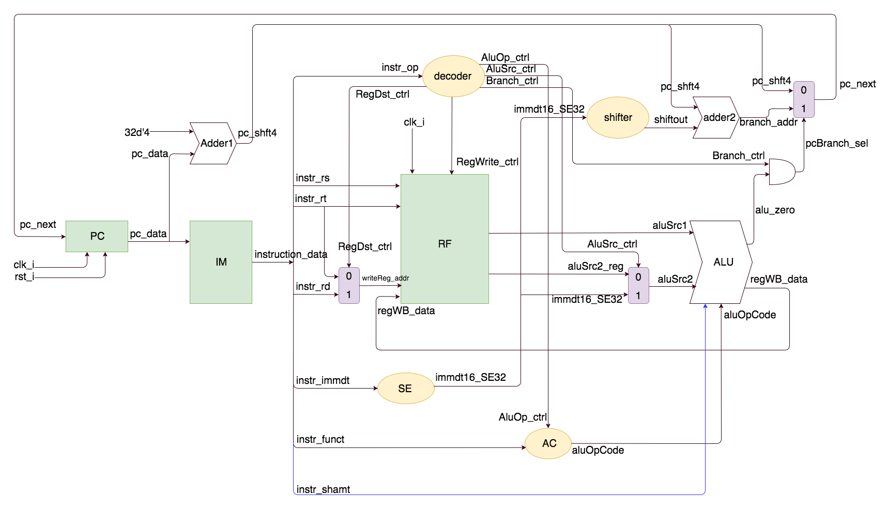

# Lab 2 

## implement a single clock-cycle CPU 

[The Notes for implementation](https://hackmd.io/JwNgTARsEIYwtAFgMYA4BmTQJgZhAmGACaIQQAMxAjLgKYRA)

+ these instructions are MIPS-like

## implement some 
+ R-type instrucitons
    * add
    * sub
    * and
    * or
    * slt  ( Set on Less Than )
    * sltu ( Set on Less Than Unsigned )
    * beq ( Branch on Equal)

+ I-tpye instructions 
    * addi ( Add Immeidate )
    ---

# Advanced intructions
 * sll
 * sllv
 * lui
 * ori
 * bne
