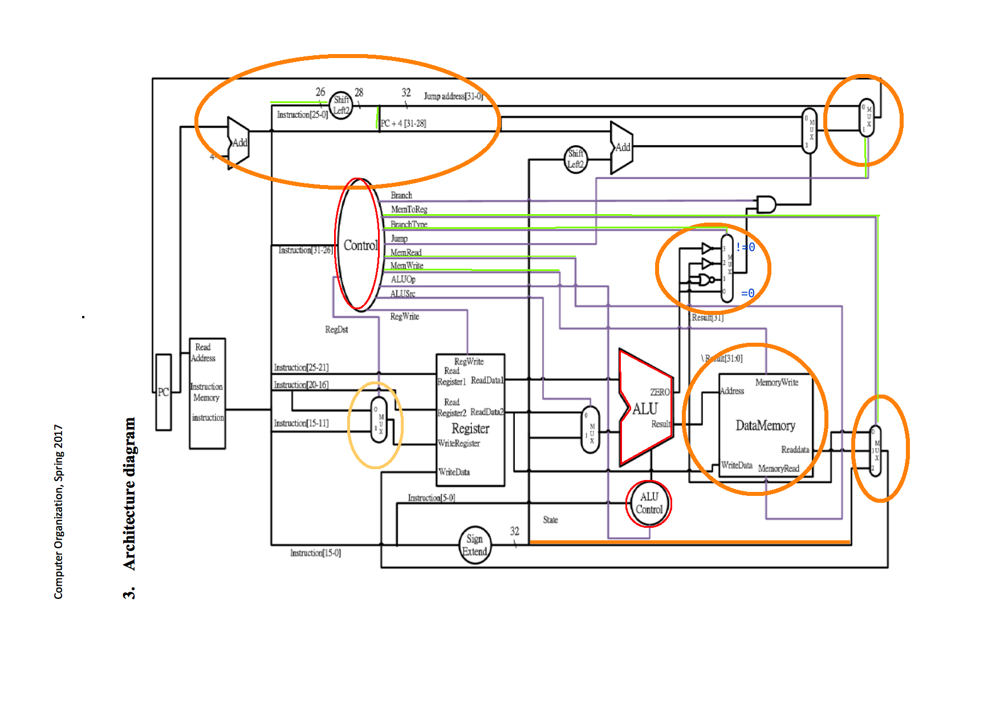
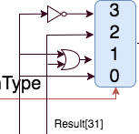
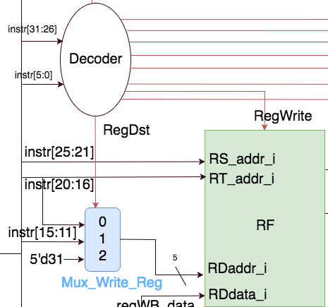

# Decoder
考量到要輸出的訊號量日益增加，且未來的 Lab 勢必會對 CPU 進行擴充，為了提升維護性與可讀性，所以把 訊號依據用途分類，並指定對應的常數來操作這些控制訊號，讓控制訊號使用起來較模組化，這樣雖然花了不少時 間，但是後來再更動設計時的成本會減少不少,而且也可以用這些較好閱讀的常數來避免打錯數字造成難以找出的 bug。自從改成這種形式後，debug 快了不少。
由於 jr 指令的 op code(0) 跟其他 add 這類指令的 op code 重疊，且需要在 decode 的同時辨認出 jr 指令以 讀取暫存器資料，所以 decoder 需要在額外接上 funct 欄位的輸入(單純為了 jr 指令)。
在常數之中，DONTCARE1, DONCARE2, DONTCARE4 具有特別用途，就是不指明運算，當控制訊號被指 派這些常數時 代表這些指令並不會用到對應的硬體資源。
		
# MUX_4to1
新增這個 4to1 的 Mux，但是大部分的時間都是拿來做成 3to1，考量到兩種 Mux 的選擇訊號都是 2bit ,兩種模組的 介面完全相同，且花費的硬體資源應該相近，應該不需要為了單純實踐 3to1 的功能而作出一個 3to1 的 Mux。

# Simple_Single.CPU
先從架構圖上大約表示這次更動的硬體

由新增指令的角度來看，這次的更動主要原因為
1. Memory 的加入
2. branch 指令的擴充
3. 為特殊型態指令 ( j, jr, jal ) 新增新的 datapath

  由此分項來討論對應原因所做的更動

## 1.Memory 的加入 
在 RF 的 WriteBack Data 之前加入一個 Mux,選擇要寫入的資料來源，額外一提: Mux 中還有另一個資 料來源是來自 immdt value(為了 LI 指令實踐的)。

## 2. branch 指令的擴充
除了bnez以外，ALU對所有branch類整令都是進行減法運算，針對branch指令，將ALU的輸出 ZERO 與 Result[31] ( 1 signed bit ) 特別在Mux_ALU_Branch_type 這個 Mux 之前做了組合電路的預處理，對每種Branch 類型產生出對應的訊號。

* 組合電路的行為

|指令|ALU運算|對應邏輯|Mux來源|
|:-: |:-: |:-: |:-: |
|BNEZ|直接輸出RS|ZERO|3|
|BLT|減法|Result[31]|2|
|BLE|減法|ZERO\|Result[31]|1|
|BEQ|減法|ZERO|0|

## 3.為特殊型態指令做的擴充
### j 指令：
重寫了 PC 的輸入之前的 Mux( Mux_PC_Source ),由原本的 2to1 變成 3to1，主要是為了接收來 自 j 指令中的 immdt 值，還有 jr 指令所帶來的值。
需要注意的是，在 Mux_PC_Source 在 Lab2 跟 Lab3 中的用途並不相同，Lab2 中對應的硬體已經 被改稱為 Lab3 另外一個 Mux (Mux_Branch_or_PCAdd4)

### jr指令：
這個指令需要將 RegisterFile 中讀出的$rs 直接接上 pc。所以將 RF 讀出的$rs 訊號(aluSrc1)額外 接上 Mux_PC_Source 當作輸入

### jal 指令：
這個指令需要將 PC+4 的值直接寫入$ra 中，所以必須要做兩個更動

1. 讓RF收到 $ra的位址以便寫入

    在修改量最小的目標下，選擇更動 RF 前方的 Mux ( Mux_Write_Reg )，由 2to1 變成 3to1, 新增的資料源就是$ra 的位址(5'31),這樣在收到 jal 指令的時候就能夠直接傳入 ra 而不修改 RF 模組。
    

2. 讓RF收到 PC+4的值

    選擇修改 ALU,讓 ALU 新增一個輸入埠(PC+4)，在收到 jal 指令時直接輸出 PC+4 的值， 提供給 RF 當作寫入資料

# ALU_ctrl
實作方法完全跟上一個 lab 相同，除了對此次 lab 的新指令新增常數來解析。
特別要注意的是，對應到 Decoder 的 DONTCARE 設計，這個模組只會針對需要做運算的指令做運算，沒指明的情 況就只會往下傳遞 DONTCARE 。

# ALU
新增PC+4這個輸入端,用在jal指令時直接輸出寫入$31($ra)使用. 除此之外只有根據新指令直接新增一些對應的運 算，因為跟 lab2 極相似且沒有甚麼架構上的大改變,所以不太需要特別解釋。